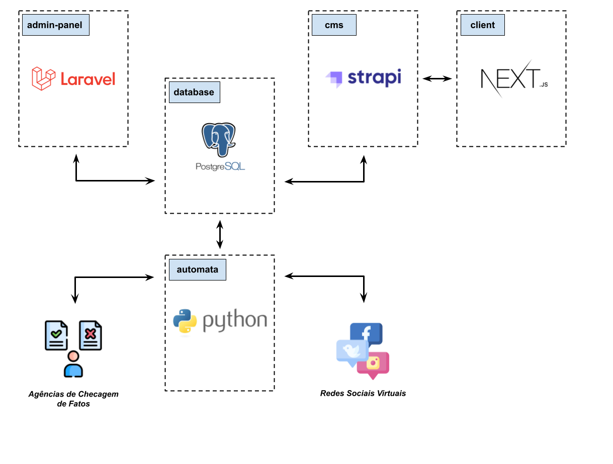

# Projeto CONFIA
Combate a Fake News Utilizando Inteligência Artificial.

O projeto CONFIA é desenvolvido por uma equipe de pesquisadores e colaboradores que tem como objetivo investigar as limitações das pesquisas existentes voltadas ao combate a Fake News e criar modelos computacionais baseados em técnicas de Inteligência Artificial e Aprendizado de Máquina que consigam superar tais limitações.

Atualmente, o projeto CONFIA possui dois subprojetos em desenvolvimento:
* AUTOMATA - Um Ambiente Computacional para Combate Automático a Fake News sobre COVID-19 e outras SARS em Redes Sociais Virtuais (CNPq proc. 401662/2020-9)
* JED - Jogos Educacionais Digitais para Apoio à Capacitação Discente na Identificação de Fake News Escritas em Língua Portuguesa

Mais informações no [site oficial](https://www.projetoconfia.info/) do projeto.

# Subprojeto AUTOMATA

## Componentes do ambiente AUTOMATA
O subprojeto AUTOMATA está organizado em um ambiente computacional composto por cinco repositórios além deste. A Figura 1 apresenta os referidos repositórios e suas relações, bem como as principais tecnologias empregadas.

|  | 
|:--:| 
| *Figura 1: Componentes do ambiente AUTOMATA* |

* Repositório `automata`: aplicação python de combate automático à Fake News em redes sociais virtuais. Composto por módulos (abaixo detalhados) que processa os dados coletados das redes sociais virtuais na forma de um _pipeline_ de processamento. A aplicação também trafega dados entre as agências de checagem de fatos e as redes sociais virtuais.

* Repositório `database`: armazena os dados coletados e processados pelo AUTOMATA.

* Repositório `admin-panel`: aplicação web que oferece uma interface gráfica de administração e configuração do AUTOMATA, bem como consulta e relatórios estatíscos dos dados processados pelo AUTOMATA.

* Repositórios `cms` e `client`: respectivamente gerenciador de conteúdo (_CMS_) e site do projeto CONFIA.

# AUTOMATA
O AUTOMA é uma aplicação python de combate automático à Fake News em redes sociais virtuais. A Figura 2 apresenta os principais módulos da aplicação e o _pipeline_ de processamento.

|  | 
|:--:| 
| *Figura 2: Módulos do AUTOMATA* |

A função de cada módulo é detalhada a seguir.

## Módulo de Monitoramento
Monitora as redes sociais virtuais em busca de publicações de notícias relacionadas a um conjunto de palavras-chave pré-configuradas. Quando uma notícia é identificada como relacionada, o módulo realiza a sua coleta, processamento e persistência na base de dados.

## Módulo de Detecção
Abriga um modelo de detecção de Fake News que classifica as notícias coletadas como `Fake` e `Não Fake`. 

## Módulo de Intervenção
Executa um algoritmo que seleciona as top `n` notícias classificadas como `Fake` pelo módulo de detecção. O algoritmo emprega como parâmetros a data de publicação da notícia, o número de compartilhamentos na rede social virtual e o grau de certeza da classificação. Conforme as configurações setadas no ambiente pode automaticamente:
* Incluir a notícia em uma lista para curadoria
* Enviar a notícia para análise por Agências de Checagem de Fatos
* Publicar alertas nas redes sociais virtuais

## Módulo de Processamento de Checagem
Módulo que processa as análises realizadas por Agências de Checagem de Fatos. Notícias confirmadas pelas Agências como `Fake` são passadas para o módulo de intervenção que publica alertas nas redes sociais virtuais.
# Instalação do ambiente AUTOMATA
Algumas componentes do ambiente AUTOMATA são opcionais, o que permite a instalação do ambinete de forma customizada.

## Instalação mínima
A instalação mínima do ambiente AUTOMATA compreende a instalação da aplicação AUTOMATA e do banco de dados. Para tal, siga as instruções presentes no repositório [automata](https://github.com/projeto-confia/automata).

## Instalação de componentes adicionais
### Componente adicional Painel Administrativo
Esta componente instala o Painel Administrativo, uma aplicação web que oferece uma interface gráfica de administração e configuração do AUTOMATA, bem como consulta e relatórios estatíscos dos dados processados pelo AUTOMATA.

Para a instalação, siga as instruções presentes no repositório [admin-panel](https://github.com/projeto-confia/admin-panel).

### Componente adicional Website
Esta componente instala o website e seu respectivo sistema gerenciador de conteúdo (CMS), para divulgação de informações do projeto.

Para a instalação, siga as instruções presentes no repositório [client](https://github.com/projeto-confia/client).

# Documentação
A documentação de mais alto nível do projeto pode ser encontrada neste repositório na pasta [docs](docs/).

Documentação específica de cada componente do ambiente pode ser encontrada nas respectivas pastas docs de cada repositório.
